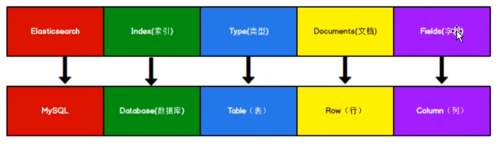
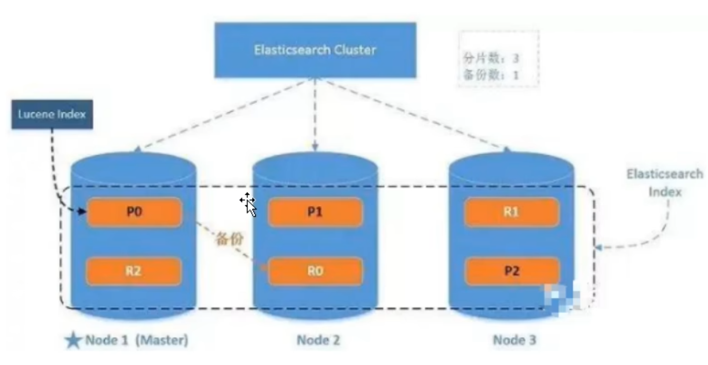

## ELK Stack

1. 包括Elasticsearch、Kibana、Beats和Logstash，能够安全可靠的获取任何来源、任何格式的数据，然后实时地对数据进行搜索、分析和可视化
2. Lucene是Apache软件基金会Jakarta项目组的一个子项目，提供了一个简单却强大的应用程式接口，能够做全文索引和搜索。es和solr均基于Lucene进行开发

## 数据格式

Elasticsearch是面向文档型数据库，一条数据在这里就是一个文档。与mysql的类比对应关系如图：

这里Types的概念已经被逐渐弱化，Elasticsearch6.X中，一个index下已经只能包含一个type ，elasticsearch7.X中，Type的概念已经被删除了

## 核心概念

#### 索引

#### 类型（已弃用）

#### 文档

#### 字段

#### 映射（Mapping）

mapping是处理数据的方式和规则方面做的一些限制，如：某个字段的数据类型、默认值、分析器、是否被索引等

#### 分片（Shards）

分片很重要的原因：

1. 允许水平分割/扩展数据
2. 允许在分片之上进行分布式、并行的操作，进而提高性能、吞吐

#### 副本（Replicas）

ES允许创建分片的一份或多份拷贝，这些拷贝叫做复制分片（副本）

副本很重要的原因：

1. 在分片/节点失败的情况下，提供高可用性。因此需要注意原分片和复制分片不应置于同一节点
2. 扩展搜索/吞吐量，因为搜索可以在所有的副本上并行允许

#### 分配（Allocation）

## 系统架构

