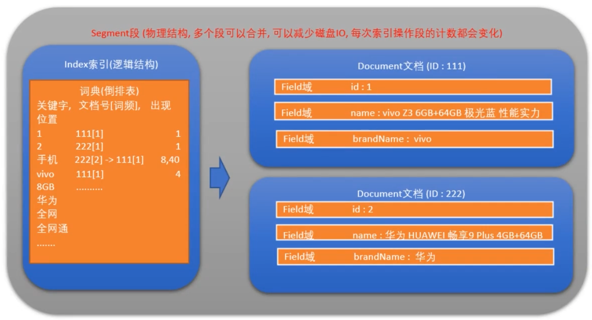
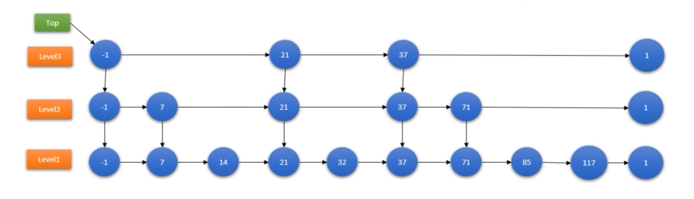

## 倒排索引

关键词为Key，表中记录了，文档的ID，出现的频率，出现的位置。

优点：搜索耗时短。

缺点：不易维护。

#### 结构

以Map 来简单描述这个结构。

* Key :分词后的单词Term，组成了 Term Dictionary (索引表，可简称为 Dictionary)。
* Value: 记录表 （Postings List）

记录表由所有的 Term 对应的数据（Postings） 组成，它不仅仅为文档 id 信息，可能包含以下信息：

* 文档 id（DocId, Document Id），包含单词的所有文档唯一 id，用于去正排索引中查询原始数据。
* 词频（TF，Term Frequency），记录 Term 在每篇文档中出现的次数，用于后续相关性算分。
* 位置（Position），记录 Term 在每篇文档中的分词位置（多个），用于做词语搜索（Phrase Query）。
* 偏移（Offset），记录 Term 在每篇文档的开始和结束位置，用于高亮显示等。

#### 倒排索引实现

## Field域类型

#### 域属性

* 是否分词
* 是否索引
* 是否存储

## Lucene底层储存结构

 注：

1. 索引中通过记录关键字在文档中出现的词频，确定文档号之间的优先级
2. lucene对于关键字的存储形式包含btree、跳表、FST

#### 物理存储结构

##### 索引库

一个目录一个索引库，一个索引库是放在一个文件夹中的

##### 段

* 一个索引由多个段组成，多个段可以合并，以减少读取内容时的IO
* Lucene中的数据写入会先写内存的一个buffer，当buffer到一定量后被flush为一个segment
* 每个segment有自己独立的索引，可以独立被查询，但数据永远不能被更改。数据写入都是批量追加。
* segment中的文档可以被删除，删除的方式是由另一个文件保存需要被删除的文档DocID
* Index的查询需要多多个segment的查询结果进行合并，还需要处理被删除的文档。为了优化查询，lucene会有策略对多个segment进行合并

## 索引结构

#### 跳跃表原理

Lucene3.0之前使用的是跳跃表结构，之后换成了FST

优点：结构简单、级数可控

缺点：模糊查询支持不好、占用空间大

#### FST原理（Finite State Transducer)

FST的最重要功能是可以实现Key到Value的映射，相当于HashMap<Key,Value>。FST的内存消耗要比HashMap少很多，但FST的查询速度比HashMap要慢

优点：内存占用率低，压缩率一般在3-20倍之间、模糊查询支持好、查询快

缺点：结构复杂、输入要求有序、更新不易

## Lucene相关度排序

#### 词的权重

* Term Frequency(tf)
  * 指term在文档中出现的次数，tf越大越重要
* Document Frequency(df)
  * 指有多少文档包含此term，df越大说明越不重要
