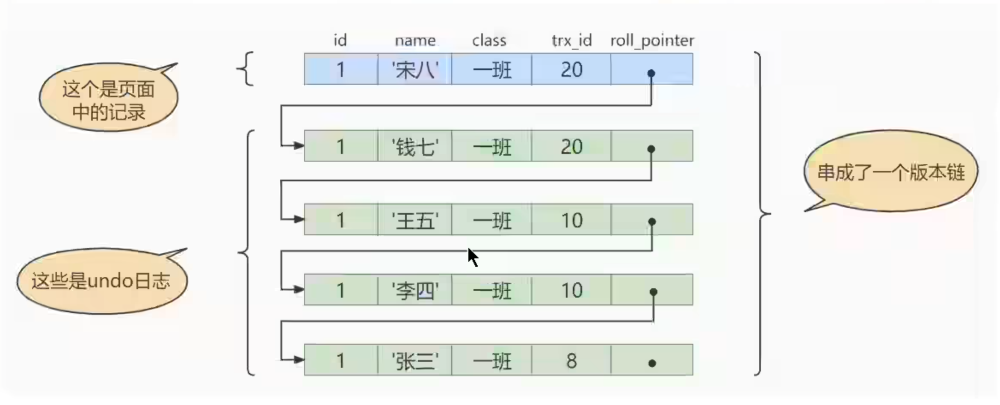

1. ## INNODB


   > innodb 核心竞争力: bufferpool,mvvc,事务,行锁,崩溃恢复(redolog和 undolog)
   >

   * 资料
     * [庖丁解INNODB](http://catkang.github.io/2020/02/27/mysql-redo.html)
     * [mysql日志篇](https://zhuanlan.zhihu.com/p/652252941)
     * [深入浅出Mysql InnoDb核心竞争力 BufferPool (1)](https://zhuanlan.zhihu.com/p/691785266)
   * 数据存储格式
   * Page存储格式
   * 
2. ## MyISAM


   * MyISAM虽然也使用B+树作为存储结构，但是索引和数据是分开的，数据按照插入顺序存储在.myd文件中
   * MyISAM的索引结构叶子节点存储的数据项是数据记录地址
3. ## Mysql架构


   * 架构图
4. ## 数据引擎


   * InnoDb 支持外键、事务、行级锁，文件格式.ibd .frm
   * MyISAM	用于小表、查询插入操作，有数据丢失风险，文件格式.myd .myi .frm
   * ARCHIVE	归档，存储时压缩数据，支持行级锁，仅支持插入和查询（查询速度高，插入速度慢），适合存储大量的独立的作为历史记录的数据
   * BLACKHOLE 丢弃所有存储的数据
   * CSV 将普通CSV作为表处理，文件格式.csm .csv
   * Memory 存储在内存，支持hash索引，数据易丢失
   * NDB
5. ## 索引


   * B+树
     * 图示
     * B+树根节点所在page万年不动
     * 二级索引中，B+树内节点目录项的索引项目，除了指定的索引项还会额外包含主键共同构成联合索引，防止二级索引项相同，增加索引插入效率
     * 
   * 聚簇索引
     * 缺点
       * 插入速度依赖于插入顺序，否则出现页分裂影响性能
       * 更新主键代价高
       * 二级索引访问需要两次索引查找
6. ## 事务
7. ## 日志
8. ## SQL性能调优


   1. 调优流程
   2. 调优手段
      * 查看系统性能参数 show status like 'slow_queries'
      * 查看查询成本 show status like 'last_query_cost'
      * 慢查询日志
        ```
          开启配置
          set global slow_query_log=on;
          慢查询配置(and关系)
          set global long_query_time=1;
          set global min_examined_row_limit=0
        ```
      * profiling
        * show profiles
        * show profile cpu,block io for query 1
      * explain
   3. JOIN调优
   4. SORT优化
      * 尝试提高sort_buffer_size（排序缓存 进程级）
      * 尝试提高max_length_for_sort_data（双路 单路选择）
      * 避免select *
   5. GROUP BY
   6. 分页查询
   7. 索引下推（ICP index condition pushdown)
   8. EXISTS与IN的区分
   9. COUNT效率对比
9. ## 事务隔离级别
10. ## 日志


    1. redo log:
       * 是存储引擎层生成的日志，记录的是物理级别上的页修改操作，比如页号、偏移量写入了xxx数据，主要为了保证数据可靠性
       * InnoDB采用了WAL技术（Write-Ahead Logging)，即先写日志，再写磁盘，只有日志写入成功，才算事务提交成功
       * 优点：降低刷盘频率、占用空间小
       * 特点：顺序写入磁盘，事务执行过程中不断记录
       * 刷盘策略：
         * Innodb_flush_log_at_trx_commit=1
         * Innodb_flush_log_at_trx_commit=2
         * Innodb_flush_log_at_trx_commit=0
    2. undo log
       * 是存储引擎层生成的日志，记录的是逻辑操作日志，比如对某一行数据进行了INSERT语句操作，那么undo log就记录一条与之相反的DELETE操作。主要用于事物的回滚和一致性非锁定读（undo log回滚行记录到某种特定的版本--MVCC）
       * 在事务更新数据的前置操作先写入undo log
    3. 更新过程日志记录
11. ## 锁


    1. 乐观锁悲观锁对比：乐观锁适合读多写少的场景，悲观锁适合写多读少场景
12. ## MVCC原理


    1. 相关字段
       1. trx_id:每次一个事务对某条聚簇索引记录进行改动时，都会把该事务的事务id赋值给trx_id隐藏列
       2. roll_pointer:每次对某条聚簇索引记录进行改动时，都会把旧的版本写入到undo日志中，然后这个隐藏列就相当于一个指针，可以通过它来找到该记录修改前的信息
          
    2. READ VIEW
       1. 定义：ReadView就是事务在使用MVCC机制进行快照读操作时产生的读视图。事务启动时，会生成数据库系统当前的一个快照，InnoDB为每个事务构造了一个数组，用来记录并维护系统当前活跃事务的ID
       2. 设计思路
          * RU隔离级别直接读取记录最新版本
          * SER级别使用加锁访问
          * RC、RR使用READ VIEW
       3. 字段设计
       4. 快照访问规则
       5. MVCC整体操作流程
       6. RC VS RR
          1. RC级别下，一个事物的每一次SELECT查询都会重新获取一次READ VIEW
          2. RR级别下，一个事务只在第一次SELECT时获取一次READ VIEW，后面所有SELECT都会复用这个READ VIEW
13. ## 日志


    1. 日志类型
    2. 二进制日志
       1. 应用场景
       2. binlog刷盘
          1. 参数sync_binlog=0（默认是0），每次提交只write，有系统自行判断fsync执行时机
          2. sync_binlog=1，每次提交事务都执行fsyc
          3. sync_binlog=N(N>1)，每次提交都write，累计N个之后fsync
       3. binlog对比redolog
       4. 两阶段提交
       5. 
14. 主从复制

    1. binlog日志格式及优缺点
    2. 主从一致性问题解决方案
       1. 异步复制
       2. 半同步复制
       3. 组复制
15. 1
16. 1
17.
