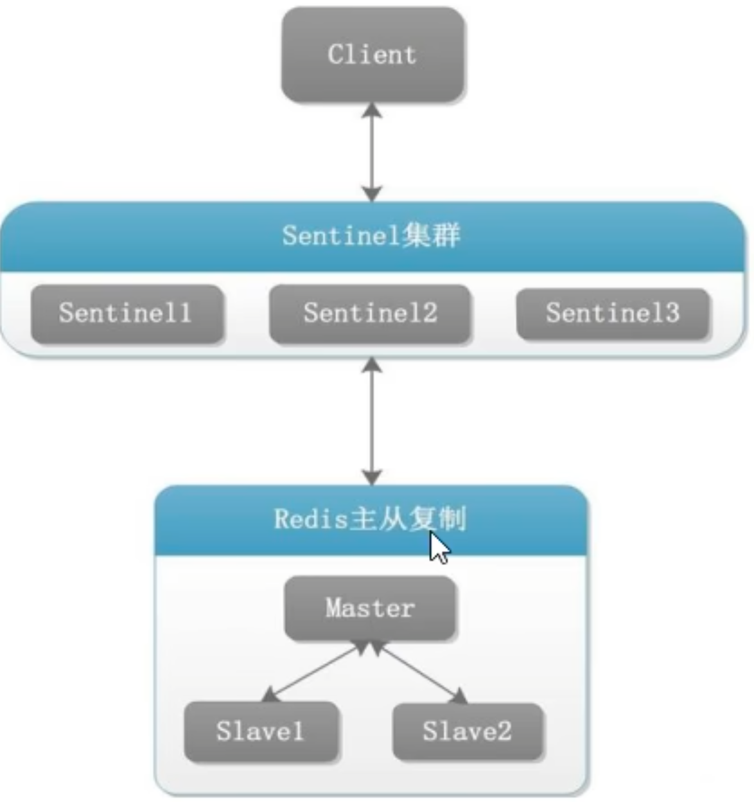

## 十大数据类型

| 数据类型                | 简述                                                                                                                        |
| ----------------------- | --------------------------------------------------------------------------------------------------------------------------- |
| Strings                 |                                                                                                                             |
| Lists                   | 底层实际是个双端链表，最多包含2^32-1个元素                                                                                  |
| Sets                    | 无序集合，哈希表实现，添删查复杂度都是O(1))                                                                                 |
| Hashes                  | 可以存储2^32-1个键值对                                                                                                      |
| Sorted Sets             | 通过哈希表实现，添删查复杂度O(1)。最大成员数2^32-1。成员唯一，但分数可重复                                                  |
| Streams                 | Redis5.0新增的数据结构，用于消息队列，童工了消息的持久化和主备复制功能                                                      |
| Geospatial（地理空间）  |                                                                                                                             |
| HyperLogLog（基数统计） | 用于在低内存使用情况下近似计算唯一元素数量的数据结构。不存储元素，而是通过概率算法，基于元素哈希来估算数量，固定占用内存12k |
| Bitmaps（位图）         |                                                                                                                             |
| Bitfields（位域）       |                                                                                                                             |

## 持久化

#### RDB

* RDB持久化以指定时间间隔执行数据集的时间点快照，以文件的形式写到磁盘上,文件名dump.rdb
* 配置：redis.conf : save 3600 1 300 100 60 10000
* 手动备份

  * save
  * bgsave
* bgsave执行原理
* COW内存回收

  * 内核提供的写时复制机制避免了大量内存拷贝以及占用过多内存
  * 子进程fork操作只是拷贝了父进程的页表数据，当fork完成后，对于一个父进程引用的内存页，其引用值从1变成2.
  * 当父进程进行写操作时，会申请一份新的内存页，并从原内存页copy所有数据，之后父进程就在新的内存页上进行操作。而原内存页就变成了子进程的**专属内存页**，引用值变成了1
  * 子进程重写完成并退出后，内核会对资源进行回收，包括占用的内存资源
  * 回收：对于页表来说，是进程专属，直接清理即可；而关联的内存页会将其引用值减1，如果引用值变成了0，该内存页就会被回收
  * 也就是复制之前的页（原内存页），变成了子进程的专属页，当子进程结束后就会被回收掉

#### AOF

* 工作流程
* 写回策略
  * everysec(默认) 每个命令执行完写到文件内存缓冲区，每秒刷回磁盘
  * always 每个命令执行完成后后立即写回磁盘
  * no 每个命令执行完只先把日志写到AOF文件的内存缓冲区，由操作系统决定何时将缓冲区内容写回磁盘
* 重写机制
  * 手动：bgrewriteaof
  * 配置：auto-aof-rewrite-percentage 100, auto-aof-rewrite-min-size 64mb，同时满足配置选项后，Redis会记录上次重写时的AOF大小，默认配置是当AOF文件是上次rewrite后大小的一倍且

#### Redis 7.x

`Redis 7` 对 `AOF` 机制进行了优化，发布了新特性 `Multi Part AOF`，将单个 `AOF` 拆分为多个，该特性由阿里云数据库 `Tair`团队贡献。

`AOF`文件分为三种类型：

* `BASE`：基础 `AOF`文件，它一般由子进程通过重写产生，该文件最多只有一个。
* `INCR`：增量 `AOF`文件，它一般会在重写开始执行时被创建，该文件可能存在多个。
* `HISTORY`：表示历史 `AOF`，它由 `BASE`和 `INCR AOF`变化而来，每次重写成功完成时，本次重写之前对应的 `BASE`和 `INCR AOF`都将变为 `HISTORY`，`HISTORY`类型的 `AOF`会被 `Redis`自动删除。

为了管理这些 `AOF`文件，引入了一个清单（`manifest`）文件来跟踪、管理这些 `AOF`。同时，为了便于 `AOF`备份和拷贝，所有的 `AOF`文件和 `manifest`文件放入一个单独的文件目录中，默认为 `appendonlydir` ：


整个执行流程如下：


##### 直接写

`Redis` 刚启动时，就会创建 `BASE`、`INCR`文件：


在没有触发重写机制时，执行流程和 `Redis 6` 一样，只是命令被写入的文件是 `appendonly.aof.1.incr.aof` 。当 `Redis` 重启时，会加载 `BASE`、`INCR`文件中的命令来重建数据集。


##### 重写

当触发重写机制后， `Redis` 主进程会阻塞等待（微秒级）并执行 `fork` 创建子进程，创建完成后，会继续接收新的请求命令，并将 `fork` 后的写操作写入到新打开的 `INCR`（增量 `AOF`）文件，不再需要写入到 **重写缓冲区** （`aof_rewrite_buf`）中，降低了内存消耗。

子进程的重写操作完全是独立的，重写期间不会与主进程进行任何的数据和控制交互，最终重写操作会产生一个新打开的 `BASE AOF`文件。

新生成的 `BASE AOF`和新打开的 `INCR AOF`就代表了当前时刻 `Redis`的全部数据。重写结束时，主进程会负责更新 `manifest` 文件，将新生成的 `BASE AOF`和 `INCR AOF`信息加入进去，并将之前的 `BASE AO`F和 `INCR AOF`标记为 `HISTORY`（会被 `Redis`异步删除）。一旦 `manifest`文件更新完毕，就标志整个重写流程结束。

`Multi Part AOF`的引入，成功的解决了之前重写存在的内存和 `CPU`开销，解决了对 `Redis`实例甚至业务访问带来的不利影响。

#### 混合持久化

* 开启方式：aof-use-rdb-preamble设置为yes
* 前提：必须开启aof
* Redis服务器在执行AOF重写操作时，会按照如下原则处理数据：

  * 像执行BGSAVE命令一样，根据数据库当前的状态生成相应的RDB数据，并将其写入AOF文件中；
  * 对于重写之后执行的Redis命令，则以协议文本的方式追加到AOF文件的末尾，即RDB数据之后。
* 图解
  
* 工作原理
  在 AOF 重写之前，RDB 和 AOF 都是按照它们各自的持久化策略工作的。当 AOF 重写被触发时，混合持久化才开始发挥作用：将当前的数据集会首先以RDB 格式写入新 AOF 文件的顶部，然后再追加新的命令到文件的末尾。
* 工作流程
  

## 事务

> 按顺序穿行化执行而不会被其他命令插入，本质是把中间执行命令入队后串行执行

```
正常执行：
MULTI
EXEC

放弃事务:
MULTI
DISCARD

命令中语法（编译）错误，EXEC时报错，不执行任何指令。
命令中存在类型（运行时）错误，EXEC时报错，所在行之前已经执行的指令不回滚。

WATCH keyName
MULTI
EXEC
在开启事务前先WATCH key，执行事务时乐观锁检查（CAS），如key值发生变更，事务在当前位置执行失败并退出

UNWATCH keyName
放弃监控
```

## PIPELINE

```
Redis是一种基于客户端-服务器端模型以及请求/响应协议的TCP服务，一个请求会遵循以下步骤：
1 客户端向服务器端发送命令分四步（发送命令->命令排队->命令执行->返回结果)，并监听Socket返回，通常以阻塞模式等待服务器响应。
2 服务端处理命令，并将结果返回给客户端
以上两步称为RTT（round trip time)

如果需要执行大量命令，就要等待上一条命令应答后再执行，这中间不仅仅多了RTT，而且还频繁调用系统IO,发送网络请求，同时需要redis调用多次read()和write()系统方法，将数据从用户态转移到内核态，这样就会对进程上下文有比较大的影响

```

Pipeline 可以一次性发送多条命令给服务端，服务端依次处理完毕后，通过一条响应一次性将结果返回，通过减少客户端与redis的通信次数来实现降低RTT。pipeline实现原理是队列，先进先出保证数据的顺序性。

原生命令与pipeline对比：

事务与pipeline对比：

pipeline注意事项：

pipeline缓存的指令只保证依次执行，不保证原子性，如果执行中发生异常，将会继续后续指令的执行

使用pipeline组装的命令数不能太多，不然数据量过大客户端阻塞的时间可能过久，同事服务端此时也被迫回复一个队列答复，占用较高内存

## 主从复制

* 配从不配主
* 基本操作命令
  * info replication 查看复制节点的主从关系
  * replicaof 主库IP 主库端口 配置文件配置
  * slaveof 主库IP 主库端口 运行时配置命令
  * slaveof no one 使当前库停止与其他数据库的主从复制关系
* 工作流程
  * slave首次启动发送sync命令，master执行RDB生成，salve执行RDB
  * master发送心跳包，发送周期repl-ping-replica-period
  * master将新命令发送给slave
  * 从机下线后重连续传。master检查backlog中的offset，master和slave都保存一个offset和masterId，断点续传只会把已经复制的offset后面的数据复制给slave
* 缺点
  * 复制延时，信号衰减
  * master宕机后集群无法服务

## 哨兵



#### 核心功能

Sentinel节点监控现有的redis master 和 slave，如果是slave挂了，并没有任何关系。但是主节点挂了， Redis Sentinel就要进行故障转移了。针对主节点故障转移流程大致如下∶

* 主节点故障，从节点同步连接中断，主从复制停止。
* 哨兵节点通过定期监控发现主节点出现故障。哨兵节点与其他哨兵节点进行协商，达成多数认同主节点故障的共识。这步主要是防止该情况：出故障的不是主节点，而是发现故障的哨兵节点或者是因为网络问题，该情况经常发生于哨兵节点的网络被孤立的场景下。‘
* 哨兵节点之间使用Raft算法选举出一个领导角色，由该节点负责后续的故障转移工作。
* 哨兵领导者开始执行故障转移：从节点中选择一个作为新主节点，让其他从节点同步新主节点。该工作也就是前面我们说到的人工操作恢复故障的工作。
* 哨兵节点会自动的通知客户端程序告知新的主节点是谁，并且后续客户端再进行写操作,就会针对新的主节点进行操作了。

  通过上述我们也能分析出redis哨兵核心功能：

1. 监控数据节点，主要是主节点；
2. 自动的故障转移；
3. 通知客户端。

  注意redis 哨兵节点只有一个也是可以的。如果哨兵节点只有一个，它自身也是容易出现问题的。万一这个哨兵节点挂了，后续redis主节点也挂了，就无法进行自动的恢复过程了。

  出现误判的概率也比较高，毕竟网络传数据是容易出现抖动或者延迟或者丢包的。如果只有一个哨兵节点出现上述因网络问题造成误判之后，影响就比较大。

 假定当前环境有三个哨兵(sentenal1, sentenal2, sentenal3),一个主节点(redis-master),两个从节点(redis-slave1, redis-slave2)。当主节点出现故障,就会触发重新一系列过程。

 

#### 节点下线判定

哨兵重新选取主节点的前提是多个哨兵节点确定主节点挂掉了。注意：是多个哨兵节点判断主节点挂掉了。怎么就多个哨兵节点可以都判断该主节点挂掉了呢？因此在 Redis 哨兵（Sentinel）中，sdown 表示主观宕机（Subjectively Down），odown 表示客观宕机（Objectively Down）。

###### 主观下线

 ** sdown 是指单个哨兵节点认为某个 master 节点宕机了** 。具体来说，如果一个哨兵节点向 master 发送 ping 命令（心跳机制），在超过指定的毫秒数之后没有收到有效回复，那么这个哨兵就会主观认为 master 宕机，将其标记为 sdown。

###### 客观下线

 **odown 则是指多个哨兵节点都认为某个 master 节点宕机了** 。当一个哨兵将 master 标记为 sdown 后，它会在指定时间内，每秒向其他哨兵发送 `i`消息来询问它们是否也认为该 master 是 sdown。如果收到该消息的其他哨兵中，有达到法定票数的数量（可配置的最小数量）的哨兵都认为那个 master 是 sdown，那么就可以认为是 odown，即客观认为 master 宕机。

 多个哨兵需要判定主节点是否挂了，这样才更加安全。但是有的时候可能因为特殊情况，比如主节点仍然工作正常，但是哨兵节点自己网络出问题了，无法访问到主节点了。此时就可能会使该哨兵节点认为主节点下线而出现误判。使用投票的方式来确定主节点是否真的挂了是更稳妥的做法，需要多个哨兵都认为主节点挂了，即票数>=法定票数之后才会真的认为主节点是挂了。

#### Leader选举流程（Raft协议)

 **确定master客观下线后，要让多个哨兵节点选出一个leader节点，由这个leader负责选一个从节点作为新的主节点** 。怎么选出一个leader呢？

 Raft 算法是一种被广泛应用于分布式系统中的共识算法，用于确保系统中的多个节点能够达成一致的决策。在 Redis 哨兵集群中，Raft 算法通常用于选举领导者（leader），以协调故障转移过程。

 假设我们有三个哨兵节点：S1、S2 和 S3。在故障转移过程中，哨兵节点之间会相互发起选举，以下是大致的选举流程：

1. 拉票请求发起：每个哨兵节点都会向其他所有哨兵节点发起拉票请求，表达自己的候选人意愿。例如，哨兵节点 A（S1）会给哨兵节点 B（S2）和哨兵节点 C（S3）发送拉票请求，哨兵节点 B（S2）会给哨兵节点 A（S1）和哨兵节点 C（S3）发送拉票请求，以此类推。
2. 投票响应：收到拉票请求的哨兵节点会根据自身的情况作出投票决定，并回复投票响应。每个哨兵节点只有一票，并且只能投给一个候选人。如果收到的是第一次拉票请求，那么响应方将投票给拉票方。如果已经给其他候选人投过票，那么就不再投票。
3. 选举结果确认：在一轮投票结束后，如果有一个候选人收到了超过半数的选票，那么它将自动成为领导者。例如，如果 S1 和 S2 都投给了 S3，那么 S3 将成为领导者。如果没有候选人获得半数以上的选票，则会重新进行选举。
4. 领导者选举完成：新选出的领导者负责挑选一个从节点升级为新的主节点。例如，如果 S3 成为了领导者，它将选择一个从节点升级为新的主节点。其他哨兵节点会观察到新的主节点的出现，从而确认选举过程已经结束

 通过上述流程我们能够看出Raft 算法的核心理念是“先下手为强”，即率先发起拉票请求的候选人更有可能成为领导者。选举的结果可能受到网络延迟的影响，因此选举过程中会有一定的随机性。

 ***在 Redis 哨兵集群中，确保哨兵节点数量为奇数有助于降低出现平票的可能性，从而减少额外的选举开销***。偶数个哨兵节点出现的平票概率相对来说大意是点。这一过程确保了集群在主节点故障时能够快速有效地进行故障转移。

#### Master节点选取规则

 选出leader后，那么由该leader选出一个从节点作为新的主节点，那么这里问题又来了：选哪个从节点呢？这里也是右挑选规则的：

* 比较优先级。优先级高(数值小的)的上位，优先级是配置文件中的配置项(slave-priority或者replica-priority )；
* 比较replication offset谁复制的数据多，高的上位。offset 为从节点从主节点这边同步数据的进度。数值越大说明从节点的数据和主节点就越接近；
* 比较run id ,谁的id 小，谁上位。这个run id生成的大小是随机的。(此时选谁都可以了，随便挑一个)。

  把新的主节点指定好了之后，leader就会控制这个这个节点执行slave no one，成为master。再控制其他节点,执行slave of ，让这些其他节点,以新的 master作为主节点了。

#### 一些注意事项

* 哨兵节点数量： 哨兵节点尽量不要只有一个，因为如果唯一的哨兵节点挂了，将会影响系统的可用性。建议至少使用三个哨兵节点，以确保高可用性。
* 奇数个哨兵节点： 最好将哨兵节点配置为奇数个。这样做有利于选举领导者，因为得票超过半数的概率更高，从而降低了出现平票的可能性。
* 哨兵节点的角色： 哨兵节点不负责存储数据，它们的主要作用是监控和管理 Redis 主从节点。实际的数据存储仍然由 Redis 主从节点负责。
* 提高可用性： 哨兵节点和主从复制结合解决了提高系统的可用性的问题，但无法解决数据丢失的问题。在极端情况下（主节点没来得及同步就挂了），可能会发生写入数据丢失的情况，因此需要结合其他机制来确保数据的持久性和一致性。
* 存储容量限制： 哨兵节点和主从复制不能提高数据的存储容量。当需要存储的数据接近或超过服务器的物理内存时，单纯依靠这种结构将难以满足需求。为了扩展存储容量，需要引入集群架构，如 Redis Cluster，以实现数据的分片和分布式存储。

## 集群

## 单线程/多线程模型

#### 单线程模型

* Redis的网络IO和键值对读写是由一个线程来完成的，Redis在处理客户端的请求、解析、执行、内容返回等由一个顺序串行的主线程处理
* Redis的其他功能，比如持久化RDB、AOF、异步删除、集群数据同步等等，其实是由额外的线程执行的
* Redis命令工作线程是单线程，但是整个Redis来说是多线程的

#### 使用单线程原因

* 开发维护简单
* 使用单线程模型也可以并发处理多客户端请求，使用IO多路复用和非阻塞IO
* 对于Redis系统来说，主要的性能瓶颈是内存或者网络带宽而非CPU

#### 速度快的原因

1. 基于内存操作
2. 数据结构简单：专门设计的数据结构，查找和操作的时间复杂度多为O(1)
3. 多路复用和非阻塞IO：使用IO多路复用功能监听多个socket连接客户端，这样就可以使用一个线程处理多个请求，减少线程切换带来的开销，避免了IO阻塞
4. 避免上下文切换：单线程模型避免了不必要的上下文切换和多线程竞争，省去了多线程切换带来的时间和性能消耗，同事不会产生死锁问题

#### 多线程模型

> 从redis6.x开始采用 **多线程** ，让 **多个线程高效的处理多个连接请求** （尽量减少网络IO的时间消耗）， **将最耗时的Socket的读取、请求解析、写入外包出去** ，剩下的命令执行仍然由主线程串行执行并和内存的数据交互。
>
> 也就是说就新增了多线程的功能来提高 I/O 的读写**性能**， **使多个 socket 的读写可以并行化** 。

#### IO多路复用

一种同步的IO**模型**，实现 **一个线程监视多个文件句柄** ，一旦某个文件句柄就绪就能够通知到对应应用程序进行相应的读写操作，没有文件句柄就绪时，就会阻塞应用程序，从而释放cpu资源。一个专家大夫和多个病人之间的关系。

Io多路复用： **单个进程能够实现处理多个客户端的连接请求。或者一个服务进程能够可以同时处理多个套接字描述符** 。


epoll的原理：将用户socket对应的文件描述符注册进epoll，然后epoll帮你监听哪些socket上有消息到达。此时的socket应该采用非阻塞模式。这样，整个过程只有在调用select、poll、epoll这些调用的时候才会阻塞，收发客户信息是不会阻塞的，整个进程或者线程就被充分利用起来。这就是事件驱动，所谓的Reactor反应模式。

##### Redis的事件处理器

Redis基于Reactor模式开发了自己的网络事件处理器-文件事件处理器（fiel event handler, FEH）,该处理器是单线程的，所以redis就是单线程模式。

**采用I/O多路复用** **同时监听多个socket** **，根据socket当前执行的事件来为 socket ** **选择对应的事件处理器** 。

当被监听的socket准备好执行accept、read、write、close等操作时，和操作对应的文件事件就会产生，这时FEH就会调用socket之前关联好的事件处理器来处理对应事件。

所以虽然FEH是单线程运行，但通过I/O多路复用监听多个socket，不仅实现高性能的网络通信模型，又能和Redis 服务器中其它同样单线程运行的模块交互，保证了Redis内部单线程模型的简洁设计。

下面来看文件事件处理器的几个组成部分。


I/O 多路复用程序会将所有产生事件的socket放入队列， 通过该队列以有序、同步且每次一个socket的方式向文件事件分派器传送socket。

###### 文件事件分派器

文件事件分派器 **接收IO多路复用程序传来的socket，并根据socket产生的事件类型，调用相应的事件处理器** 。

###### 文件事件处理器

服务器会 **为执行不同任务的套接字关联不同的事件处理器** ， 这些处理器是一个个函数， 它们定义了某个事件发生时， 服务器应该执行的动作。

Redis 为各种文件事件需求编写了多个处理器，若客户端**连接Redis，对连接服务器的各个客户端进行应答，就需要将socket映射到** **连接应答处理器** **，写数据到Redis，接收客户端传来的命令请求，就需要映射到** **命令请求处理器** **，从Redis读数据，向客户端返回命令的执行结果，就需要映射到** **命令回复处理器** ，当主服务器和从服务器进行复制操作时， 主从服务器都需要映射到特别为复制功能编写的复制处理器。

#### Reactor模式

##### 单线程Reactor模式

服务器端的Reactor是一个线程对象，该线程会启动事件循环，并使用Acceptor事件处理器关注ACCEPT事件，这样 **Reactor会监听客户端向服务器端发起的连接请求事件(ACCEPT事件)** 。

客户端向服务器端发起一个连接请求，Reactor监听到了该ACCEPT事件的发生并 **将该ACCEPT事件派发给相应的Acceptor处理器来进行处理** 。 **建立连接后关注的READ事件** ，这样一来Reactor就会监听该连接的READ事件了。

当 **Reactor监听到有读READ事件发生时，将相关的事件派发给对应的处理器进行处理** 。比如，读处理器会通过读取数据，此时read()操作可以直接读取到数据，而不会堵塞与等待可读的数据到来。

在目前的单线程Reactor模式中，不仅I/O操作在该Reactor线程上，连非I/O的业务操作也在该线程上进行处理了，这可能会大大延迟I/O请求的响应。所以我们应该将非I/O的业务逻辑操作从Reactor线程上卸载，以此来加速Reactor线程对I/O请求的响应。


#### Redis6.0为什么要引入多线程呢？

从Redis自身角度来说，因为 **读写网络的read/write系统调用占用了Redis执行期间大部分CPU时间** ，瓶

颈主要在于网络的 IO 消耗，多线程任务可以 **分摊 Redis 同步 IO 读写负荷** 。

#### Redis6.0多线程的实现机制

流程简述如下：

1、主线程负责接收建立连接请求，获取 socket 放入全局等待读处理队列

2、主线程 **处理完读事件之后** ，通过 RR(Round Robin) **将这些连接分配给这些 IO 线程**

3、**主线程阻塞等待 IO 线程读取 socket 完毕**

4、主线程通过单线程的方式执行请求命令，请求数据读取并解析完成，但并不执行回写 socket

5、主线程阻塞**等待 IO 线程将数据回写 socket 完毕**

6、解除绑定，清空等待队列

该设计有如下特点：

1、**IO 线程要么同时在读 socket，要么同时在写，不会同时读或写**

2、**IO 线程只负责****读写 ** **socket 解析命令** ，不负责命令处理

注意：Redis的多线程不存在线程**并发**安全问题。Redis的多线程部分只是用来处理网络数据的读写和协议解析，执行命令仍然是单线程顺序执行。所以我们不需要去考虑控制 key、lua、事务，LPUSH/LPOP 等等的并发及线程安全问题。

## BIGKEY

* string类型控制在10kb以内，hash、list、set、zset元素个数不超过5000
* 非字符串的bigkey，不要使用del删除，使用hscan、sscan、zscan方式渐进式删除。
* 注意防止bigkey过期时间自动删除问题（如一个200万的zset过期触发del操作，造成阻塞，并且该操作不会出现在慢查询中）

#### lazy free

> lazy free可译为惰性删除或延迟释放；当删除键的时候,redis提供异步延时释放key内存的功能，把key释放操作放在bio(Background I/O)单独的子线程处理中，减少删除big key对redis主线程的阻塞。有效地避免删除big key带来的性能和可用性问题。

> UNLINK命令是与DEL一样删除key功能的lazy free实现。唯一不同时，UNLINK在删除集合类键时，如果集合键的元素个数大于64个(详细后文），会把真正的内存释放操作，给单独的bio来操作

##### lazyfree-lazy-eviction

针对redis内存使用达到maxmeory，并设置有淘汰策略时；在被动淘汰键时，是否采用lazy free机制；
因为此场景开启lazy free, 可能使用淘汰键的内存释放不及时，导致redis内存超用，超过maxmemory的限制。此场景使用时，请结合业务测试。

##### lazyfree-lazy-expire

针对设置有TTL的键，达到过期后，被redis清理删除时是否采用lazy free机制；
此场景建议开启，因TTL本身是自适应调整的速度。

##### lazyfree-lazy-server-del

针对有些指令在处理已存在的键时，会带有一个隐式的DEL键的操作。如rename命令，当目标键已存在,redis会先删除目标键，如果这些目标键是一个big key,那就会引入阻塞删除的性能问题。 此参数设置就是解决这类问题，建议可开启。

##### slave-lazy-flush

针对slave进行全量数据同步，slave在加载master的RDB文件前，会运行flushall来清理自己的数据场景，
参数设置决定是否采用异常flush机制。如果内存变动不大，建议可开启。可减少全量同步耗时，从而减少主库因输出缓冲区爆涨引起的内存使用增长。

## 缓存双写一致性

#### 查询策略

* 同步直写：写数据库后同步写redis缓存，缓存和数据库中的数据一致

  * 异步缓写

    * 正常业务运行中数据库数据变动后，可以在业务允许情况下，一定时间后作用于缓存
    * 异常情况出现，不得不将失败动作重新修补，可能需要借助kafka或者rabbitMQ等消息中间件实现重试重写

    双检加锁策略：防止多线程场景批量读同一个key出现缓存击穿

    

    ```
    def method(key) {
    	val = getValFromRedis(key);
    	if val == null) {
    		lock(key) {
    			val = getValFromRedis(key);
    			if (val == null) {
    				val = getFromDB(key);
    				syncRedis(key, val);
    			}
    		}
            }
    	return val;
    }
    ```

#### 更新策略

* 先更新数据库，再更新缓存
  * 并发场景存在缓存脏数据问题
* 先更新缓存，再更新数据库
  * 并发场景存在缓存脏数据问题
* 先删除缓存，在更新数据库
  * 并发场景存在缓存脏数据问题
* 先更新数据库，再删除缓存（推荐）
  * 存在更新数据库过程中，业务侧仍在读取缓存脏数据问题
  * 并发场景下，存在其他线程查询逻辑下，查询线程先查到脏数据，在更新线程删除后查询线程更新缓存称为之前脏数据的场景
* 延时双删：先删除缓存，再更新数据库，延时一定时间再删除缓存（推荐）
  * 延时时长参考读取db并写缓存的时间监控数据
  * 延时用于防止多线程写入脏数据
