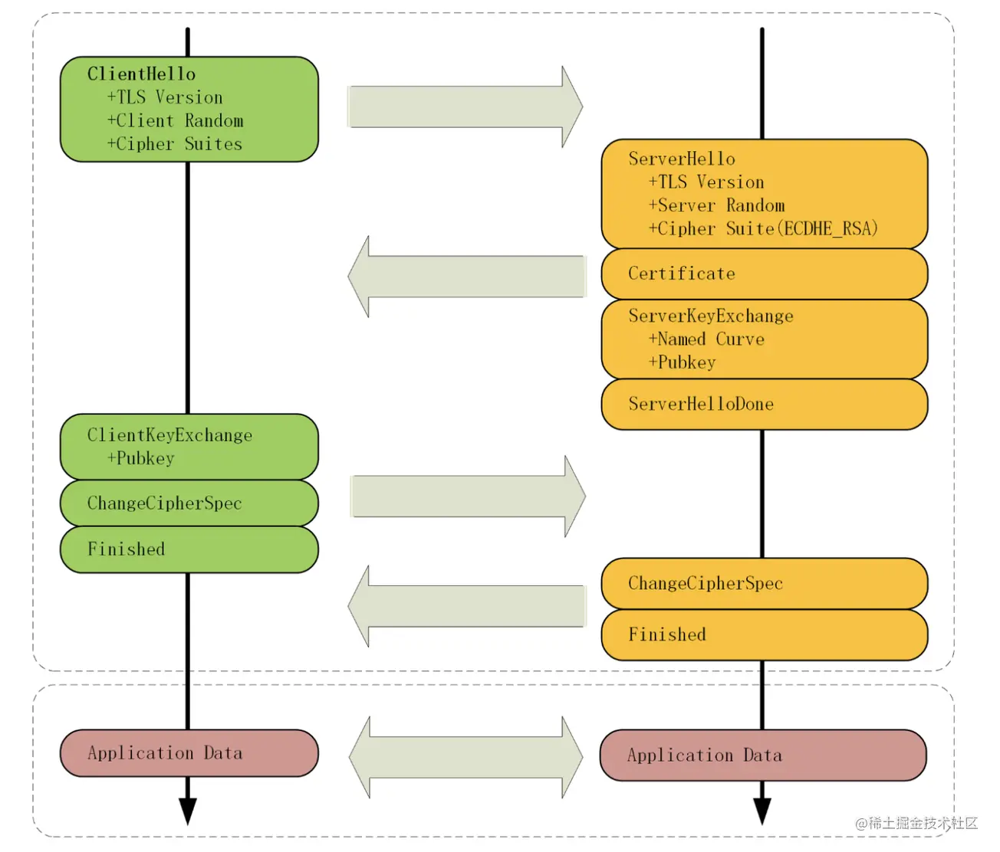
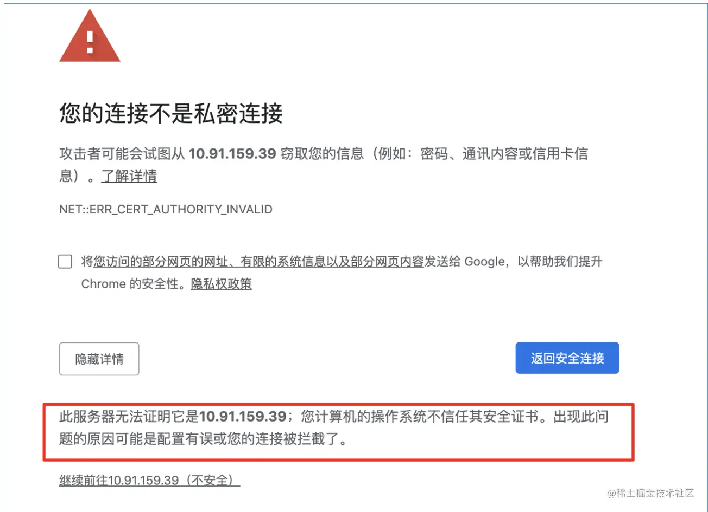

## 三次握手

* [三次握手概述](https://zhuanlan.zhihu.com/p/668860691)

## Https握手

#### TLS 握手过程

在 http 协议中，TCP三次握手成功后，浏览器会立即发送请求报文；但是https协议，它还需要另一个握手过程（TLS握手），在TCP上建立安全连接，之后才是收发报文。TLS握手的主要目的是使用非对称加密交换对称密钥，这个对称密钥是由三个随机数生成的。

TLS握手一共4个回合：

**1.客户端发出请求**

* 支持的协议版本，比如TLS 1.0版
* 一个客户端生成的随机数，稍后用于生成"会话密钥"
* 支持的密码套件（支持的加密方法）

**2.服务器回应**

* 确认使用的加密通信协议版本，比如TLS 1.0版本。如果浏览器与服务器支持的版本不一致，服务器关闭加密通信。
* 一个服务器生成的随机数，稍后用于生成"会话密钥"
* 确认使用的加密方法，比如RSA公钥加密
* 服务器证书

**3.客户端回应**

客户端收到服务器回应以后，开始走证书链逐级验证，确认证书的真实性，如果证书不是可信机构颁布、或者证书中的域名与实际域名不一致、或者证书已经过期，就会向访问者显示一个警告，由其选择是否还要继续通信：

如果证书真实有效，从证书中拿出服务器公钥，向服务器发送下面三项信息：

* 一个用服务器公钥加密随机数（pre-master key），防止被窃听
* 编码改变通知，表示随后的信息都将用双方商定的加密方法和密钥发送（Change Cipher Spec）
* 客户端握手结束通知（Finished），表示客户端的握手阶段已经结束。这一项是把之前所有发送的数据做个摘要（hash值），再加密一下，供服务器校验

上面第一项的随机数，是整个握手阶段出现的第三个随机数，又称"pre-master key"。有了它以后，客户端和服务器就同时有了三个随机数，接着双方就用事先商定的加密方法，各自生成本次会话所用的同一把"会话密钥"。

**4.服务器的最后回应**

服务器收到客户端的第三个随机数pre-master key之后，计算生成本次会话所用的"会话密钥"。

然后，向客户端最后发送下面信息：

* 编码改变通知，表示随后的信息都将用双方商定的加密方法和密钥发送（Change Cipher Spec）
* 服务端握手结束通知（Finished），表示服务端的握手阶段已经结束。这一项是把之前所有发送的数据做个摘要（hash值），再加密一下，供客户端校验

TLS握手结束后，双方开始使用对称会话密钥进行加密通信。
